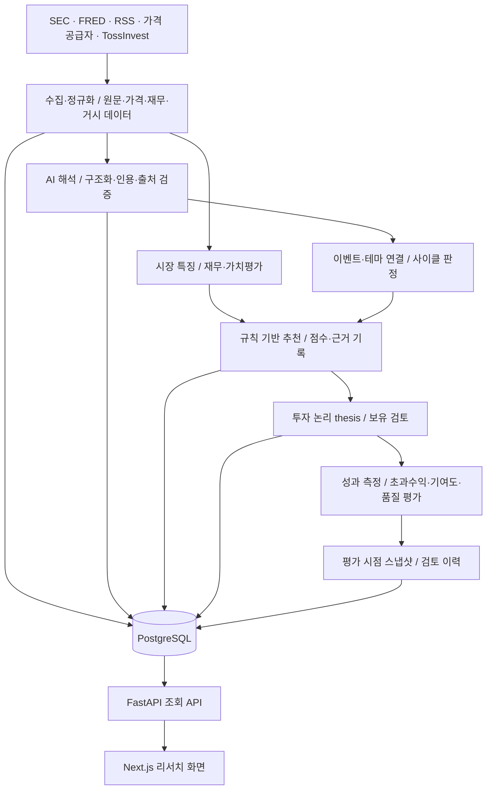

# stockA 프로젝트·전체 브랜치 조사

후속 상태: 이 문서는 정리 전 조사 스냅샷이다. 같은 날 사용자 승인으로 PR #49 병합과 완료 기능 브랜치 49개 삭제, 평가 이력 후속 구현을 진행했다. 최신 결과는 `docs/tasks/evaluation-history-completion-v1/handoff.md`를 참고한다.

조사 기준: 2026-09-08, GitHub `gwkim92/stockA`의 실제 원격 refs와 PR/CI 상태. 처음 비어 있던 현재 폴더에 전체 이력을 clone했으며, 로컬 checkout은 `develop`이다. 기능 코드 수정·merge·push·배포는 수행하지 않았다.

## 핵심 판단

stockA는 **시장 데이터와 원문 근거를 수집하고, AI 분석과 규칙 기반 추천을 연결한 뒤, 보유 판단과 사후 성과를 기록하는 투자 리서치 시스템**이다. 화면·백엔드·DB·운영 CLI가 이미 구현되어 있다. 일부 초기 문서의 “설계 단계”, “초기 구현 예정” 설명만으로 현재 상태를 판단하면 안 된다.

실제 개발 기준은 `develop@1d9d8dcc3699152a1fe435a304d95d96d930b9b1`이다. 기본 브랜치 `main@ab8278f60e3c514c61b370752ba8332f4c0a2af6`는 2026-05-01에 머물러 있으며 `develop`에만 1,219개 커밋이 있다. 양쪽 최종 tree 차이는 2,399개 파일, 추가 295,338줄/삭제 1,669줄이다. 커밋 수는 merge commit을 포함한 Git 도달 가능성 기준이다.

현재 원격 브랜치 **51개 전부**를 조사했다. 46개는 `develop`의 조상, 3개는 squash 병합으로 커밋 ID가 달라진 완료 브랜치, 1개는 `develop` 자체, 1개는 미병합 작업이다. 따라서 과거 브랜치 이름 50개를 각각 별도 미완료 제품으로 볼 필요가 없다.

## 제품과 데이터 흐름

- **입력:** SEC 공시·companyfacts, FRED 거시지표, RSS 뉴스, Alpha Vantage/Twelve Data 가격, TossInvest 시세·계좌 조회 어댑터가 등록되어 있다. SPY/QQQ 운용사 자료 수집, 은 가격 대용 지표와 달러 지표의 지연 정책도 존재한다. 구현된 공급자와 현재 사용 가능한 인증·데이터 범위는 서로 다른 문제다.
- **AI:** 뉴스 번역·이벤트 구조화, 증거 검색/RAG·그래프, 사이클 요약, 기업 리서치 등의 모듈이 있다. registry에는 13개 역할 정의와 모델·입력량·요청량·비용 정책이 있다. 역할 정의 13개가 모두 실운영 파이프라인에서 실행된다는 뜻은 아니다. 기업 리서치 batch는 현재 `fixture`와 `codex_oauth` provider를 허용하며, 전체 registry의 SDK 경로와 구분해야 한다.
- **판단:** `signal/recommendation.py`가 점수·순위·추천 후보를 계산한다. 현재 코드의 기본 축은 cycle 0.45, momentum 0.25, short-term 0.15, rank 0.15이며 macro-flow 보정은 별도로 존재한다. 이 값은 코드 기본값 조사이며 운영 환경의 유효 설정을 검증한 결과는 아니다. 전문 재무·가치평가 자료를 수집하는 기능과 그 자료가 실제 추천 가중치에 반영되는 범위도 구분해야 한다.
- **기업 분석:** 재무 정규화, 전망 입력, 동종기업 비교, 사업부 자료 해석, SOTP 가치평가, 자료 커버리지·부족 원인 분류가 구현되어 있다. 공급 자료나 지원하지 않는 공시 구조 때문에 분석이 제한될 수 있도록 상태가 나뉜다.
- **사후 검토:** 추천/thesis의 기간별 성과, benchmark 대비 초과수익, 포트폴리오 기여도, 누락 데이터, 검토 결정·후속 feedback을 다룬다. 성과 화면은 저장 요약과 현재 전달받은 outcome 행을 재계산한 수치도 비교한다. 이것을 모든 과거 평가의 불변 이력 UI로 해석하면 안 된다.

## 구현 구조

| 영역 | 실제 경로 | 책임 |
|---|---|---|
| 웹 | `apps/web/src/app`, `components`, `lib` | Next.js App Router, React 화면·DTO 정규화·검토 상태 |
| 조회 API | `src/stockanalysis/frontend` | FastAPI, fixture/live/auto 소스 분기, PostgreSQL pool, 인증·페이지네이션 |
| 데이터 수집 | `src/stockanalysis/ingest` | 공급자 어댑터, 원문·가격·재무·거시 적재 |
| AI | `src/stockanalysis/ai`, `ai_agents` | 리서치 실행, prompt/output 계약, 출처·인용 검증, fallback·저장 |
| 판단 | `src/stockanalysis/signal` | 특징값·사이클·추천·thesis·보유 검토 |
| 성과 | `src/stockanalysis/performance` | outcome, attribution, coverage |
| 운영 | `src/stockanalysis/operations` | 데이터 실행 순서, 주기별 profile, 품질 검사, 평가 기록 |
| 주문 경계 | `src/stockanalysis/trading` | paper validation, safety 판단, 비활성 Toss 주문 stub |
| 저장소 | `db/migrations`, `db/seeds` | PostgreSQL canonical tables와 기준 데이터 |

`develop` 추적 파일 기준 Python 소스 192개, Python 테스트 파일 150개, SQL migration 35개, Next.js page 29개다. 의존성 선언은 Python >=3.11, FastAPI/httpx/psycopg/uvicorn, 선택 설치인 OpenAI Agents SDK·OpenTelemetry, 웹은 Next 16.3.4 / React 19.2.5 / TypeScript 6.0.3이다. DB schema는 `ops/ref/ingest/market/macro/event/signal/portfolio/performance/research/trading/ai` 12개다. DuckDB/Parquet는 설계 문서의 보조 분석 방향이며 이 조사에서 운영 경로를 확인하지 않았다.

주요 화면은 홈, `/stocks`, 종목 상세·검토, `/recommendations`, 추천 상세, thesis·원문·AI 근거 상세, `/events`, 테마 상세, `/cycles`, `/cycle-map`, `/market-map`, `/portfolio/coverage`, `/performance`, `/research-notes`, `/data-health`, `/admin/ai-agents`다. paper-trading/trading-readiness/remediation 화면도 있다.

웹은 서버측 `frontend-api.ts`에서 설정된 API 주소를 호출하고 read token을 전달한다. 기본 주소는 `127.0.0.1:8765`이며 `cache: no-store`를 사용한다. API는 `fixture`, `live`, `auto`를 지원하므로 화면이 보인다는 사실만으로 실제 DB 연결을 입증할 수 없다. production profile은 인증 token, 명시적 origin, live DB 설정을 요구한다. 일반 `/api/*`는 조회 경계지만 Codex OAuth 재로그인·smoke용 보호된 관리 POST 경로는 별도로 존재한다.

운영 실행은 `stockanalysis-operations` CLI와 `operating_data_orchestrator.py`가 소유한다. 뉴스 intraday, 시장 daily, 판단 daily, 거시 weekly, 성과 monthly, Toss 시세·계좌 조회, cross-asset, 수동 full-recovery 등의 profile이 있다. `AGENTS.md`는 EC2 배포 기준을 `develop`으로 고정한다. 이 조사에서는 서버·스케줄러를 실행하거나 접속하지 않았다.

## 브랜치 통합 상태

| 구분 | 개수 | 해석 |
|---|---:|---|
| `develop`에 Git 조상으로 포함 | 46 | 해당 head까지의 이력은 이미 도달 가능. `main` 포함 |
| squash 병합 완료 | 3 | 아래 3개 PR의 merge commit tree와 branch head tree가 정확히 동일 |
| 통합 기준 `develop` | 1 | 현재 조사·로컬 checkout 기준 |
| 미병합 | 1 | PR #49, `develop` 대비 +13 / -0 |

Squash 병합 세 건:

| 브랜치 | PR | 원래 head | `develop` 측 병합 커밋 | 검증 |
|---|---|---|---|---|
| `feature/frontend-detail-routes` | #1 | `45fc2db5` | `d1ac52c6` | 전체 tree 동일 |
| `codex/recommendation-quality-audit-v1` | #47 | `d85ff130` | `b5df652f` | 전체 tree 동일 |
| `codex/recommendation-eval-persistence-v1` | #48 | `b8118e26` | `1d9d8dcc` | 전체 tree 동일 |

이 세 브랜치의 ahead 숫자는 미반영 변경의 개수가 아니다. Git ancestry만 보고 다시 merge하거나 cherry-pick하면 이미 반영된 기능을 중복 처리할 수 있다.

개발 흐름은 대체로 ① 5월 초기 데이터·프런트엔드 API ② 6월 로컬/EC2 운영과 cross-asset·전문 기업 분석·Toss 연동 ③ 9월 근거 계보·리서치 UX·분석 입력/저장 계약 강화 ④ 최근 평가 품질·스냅샷·이력 API 순서다. 전체 이름·SHA·기능·PR·ahead/behind는 [branches.md](/Users/woody/Documents/ChatGPT/stockA/docs/tasks/project-branch-survey-2026-09-08/branches.md), 원본 기계 판독 목록은 [branch-inventory.json](/Users/woody/Documents/ChatGPT/stockA/docs/tasks/project-branch-survey-2026-09-08/branch-inventory.json)에 있다. 삭제된 과거 PR 브랜치는 [pull-requests.json](/Users/woody/Documents/ChatGPT/stockA/docs/tasks/project-branch-survey-2026-09-08/pull-requests.json)의 과거 이력으로만 구분했다. 현재 공개된 tag는 없다.

## 아직 병합되지 않은 PR #49

[추천 평가 이력 조회 PR](https://github.com/gwkim92/stockA/pull/49), head `745bef3340f316bb843bc4e1d50fe33d39f553b0`. 조회 시점 `OPEN`, `MERGEABLE`, `CLEAN`. 현재 head의 Evaluation History 및 Evaluation History Read Contract 두 check 모두 `SUCCESS`다. 자동 병합은 수행하지 않았다.

10개 파일이 달라진다. 핵심은 신규 `frontend/recommendation_eval_history.py`와 기존 `api_adapter.py` dispatch 연결이며 나머지는 테스트·CI·task 문서다. 신규 DB migration·웹 화면 변경은 없다.

- `GET /api/recommendation-evaluations?limit=25&before=<run ID>`
- `GET /api/recommendation-evaluations/eval-run-<ID>?limit=25&after=<snapshot ID>`

평가 계열을 제한하고 bigint ID를 정규 검증하며 최대 100개 keyset pagination을 적용한다. 과거 스냅샷을 현재 추천·thesis·outcome 테이블에서 재조립하지 않는다. legacy 이력 없음, 기록된 빈 결과, 행 수 불일치, DB/schema 사용 불가를 구분한다. 확인한 저장 이력 DTO는 평가 시점 capture라는 사실과 hash 재검증을 수행하지 않았다는 사실을 명시한다.

남은 범위는 화면 연결, 현재 값과 과거 값의 차이 표시, 이후 outcome 비교, snapshot hash 재검증이다. 현재 `/performance` 품질 화면은 이미 병합되어 있지만 이 신규 이력 API를 사용하는 화면은 아니다.

## 해석·유지보수 시 주의점

1. **서버 상태 문서는 과거 증거다.** `AGENTS.md`에 6월 측정일, 당시 open gate·성과 표본 수, 이전 IP와 뒤이은 고정 IP 기록이 함께 남아 있다. “현재”, “최신”이라는 문구를 오늘 상태로 재사용하면 안 된다. live 환경은 따로 조회해야 한다.
2. **분석 신뢰성과 투자 성과는 별개다.** prompt 계약, UTC cutoff, 종목별 실패 격리, 결과·호출의 원자적 저장, receipt 진단은 처리 신뢰성을 높인다. 이것만으로 기업 해석의 정확성, 완전한 point-in-time 재현, 추천 초과수익이 입증되지는 않는다.
3. **저장 위치와 시점을 구분해야 한다.** 개인 검토 초안·inbox·연속 검토는 localStorage를 사용한다. 계정 간·기기 간 서버 동기화로 볼 수 없다. 평가 스냅샷은 DB 저장이지만 추천 생성 당시가 아니라 평가 실행 당시 확보한 상태다. migration의 append-only 주석만으로 관리자 수준의 UPDATE/DELETE까지 불가능한 저장소라는 뜻은 아니다.
4. **코드 집중도가 높다.** `frontend/live_adapter.py` 23,179줄, `professional_equity_analysis.py` 5,179줄, `operations/cli.py` 4,665줄이다. 이 파일들은 기능 변경 시 영향 범위를 넓힐 가능성이 있어 도메인 단위 분리 후보로 볼 수 있다. 이는 구조 관찰이며 실제 성능 결함을 입증한 결과는 아니다.
5. **Toss 주문은 비활성이다.** `TossInvestOrderAdapter`의 submit/modify/cancel은 disabled 오류를 내도록 구현되어 있다. 데이터 조회와 paper 검증 기능이 존재하는 것을 실거래 가능 상태로 해석하면 안 된다.

후속 개발은 `develop`을 기준으로 잡고, PR #49의 이력 API를 통합할지 검토한 다음 평가 이력 UI와 실제 runtime 데이터 상태를 확인하는 순서가 현재 코드의 연결 관계에 맞는다. 기존 scoring·weight를 바꾸는 작업은 이 조사에서 수행하지 않았다.

## 이번 검증과 한계

로컬 Python 3.14.5에서:

- `bash scripts/verify_analysis_integrity_ci.sh`: 분석 무결성 93개 + 기존 운영 CLI 107개, 모두 통과.
- 기존 `scripts/verify_research_display_contract.py`의 `main()`: 123개 통과, failure/error/skip 0, 예상 밖 외부 IO 0. 원본 코드를 수정하지 않고 보고서 출력 ROOT만 현재 조사 폴더로 지정했다. 인증 probe 3건은 기존 runner가 synthetic 처리했다.
- 합계 323개 테스트 실행 통과. 전체 테스트 suite나 모든 브랜치의 개별 runtime 검증을 수행한 것은 아니다.
- 모든 실제 원격 branch ref를 목록과 비교하고, 세 squash 브랜치의 전체 tree 동일성을 검사했다. 원격 PR 및 현재 head CI 상태도 확인했다.

이번에 프런트엔드 build·브라우저 검증, 실DB migration/쿼리, EC2·인증·공급자 갱신·모델 호출·투자 수익 검증은 실행하지 않았다. GitHub CI가 수행한 disposable PostgreSQL 검증과 이번 로컬 검증은 구분한다. 원격 저장소의 전체 커밋마다 전수 코드 리뷰한 결과도 아니다. 모든 branch head의 상태·최근 변경 이력과 현재 통합 코드의 핵심 흐름을 조사한 결과다.

증거: `analysis-integrity.log`, `research-display.log`, `research-display-report.json`, `branch-inventory.json`, `pull-requests.json`, `pr49.json`, `ci-runs.json`.
